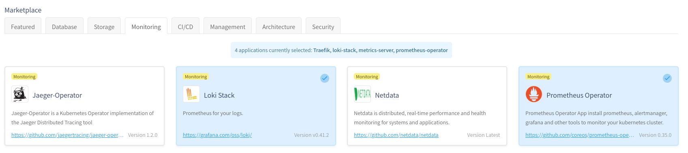
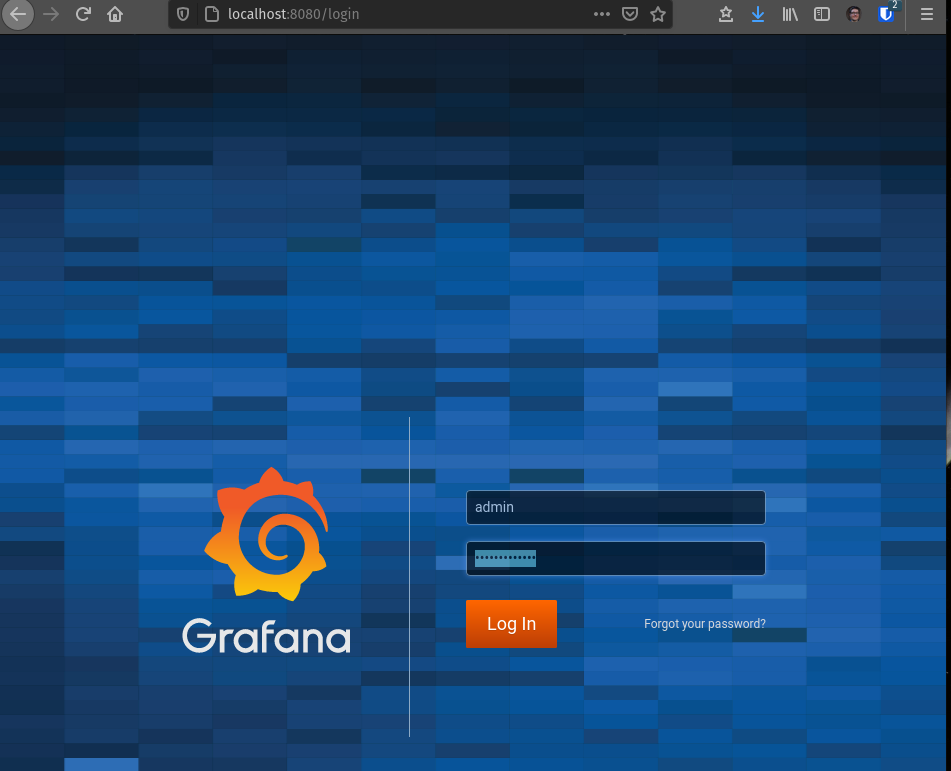
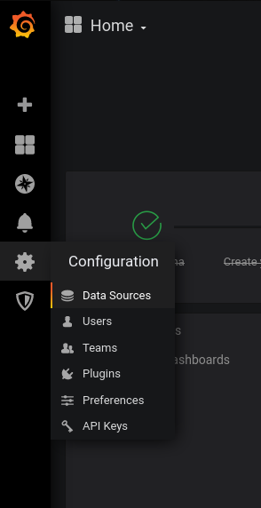
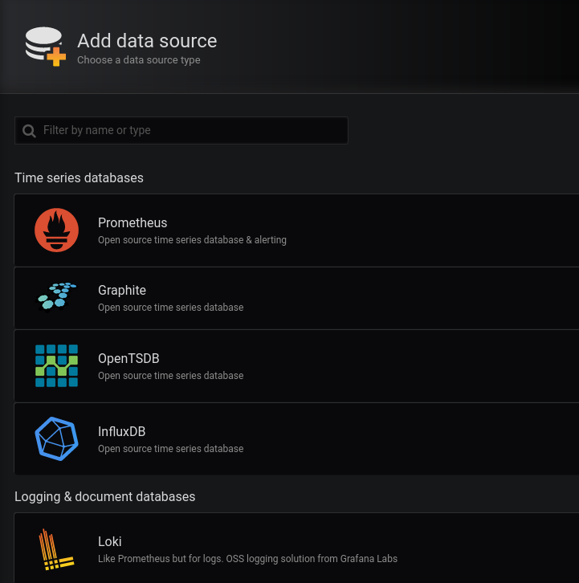
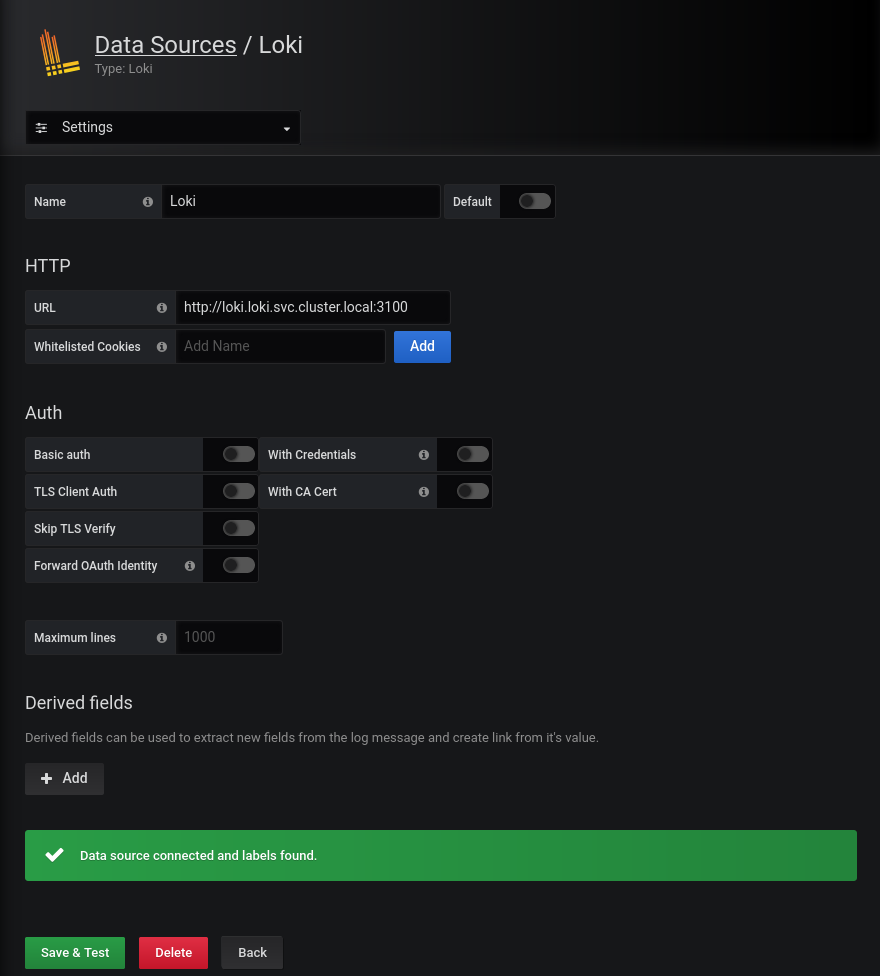
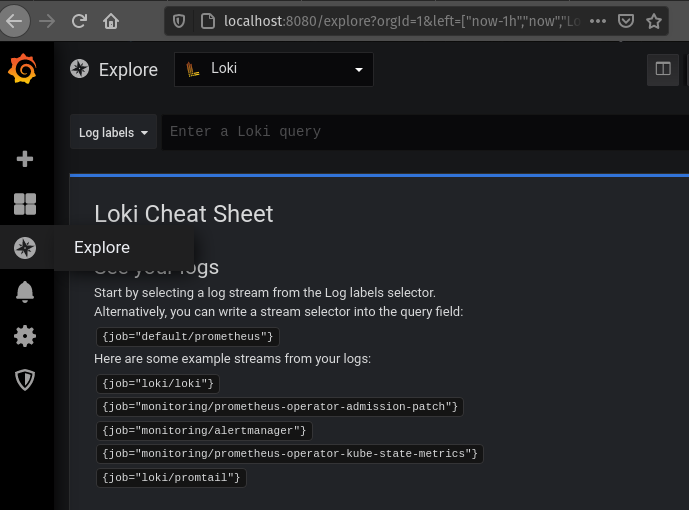
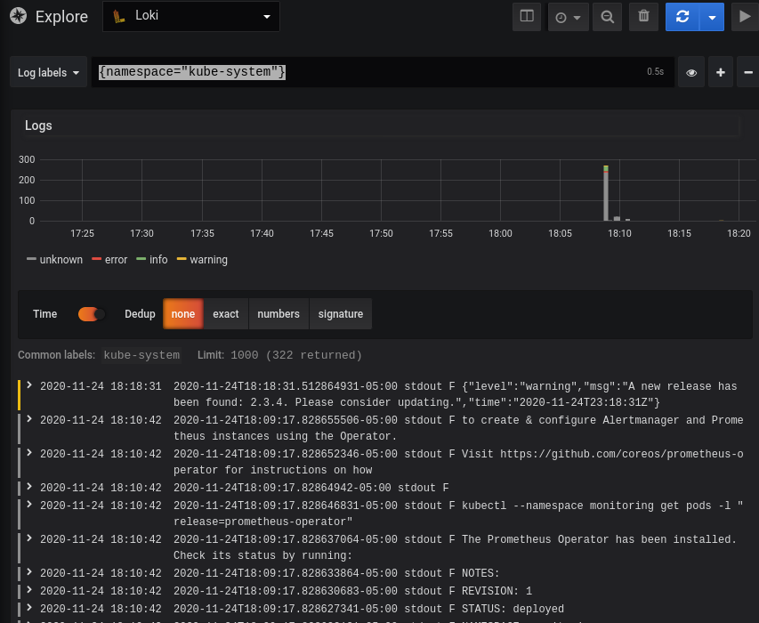
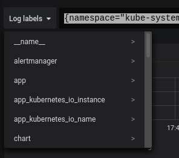

# Kubernetes Logging with Grafana's Loki

I love modern application and stack observability. Anyone that remembers the old days of stringing together Nagios and Syslog into a cobbled-together stack can certainly sympathize. Now solutions exist that provide a more integrated experience across metrics, logs, and tracing. Today I'll be concentrating on the logs component with Grafana's Loki, and demonstrate that stack on a Civo k3s cluster.

Kubernetes itself provides some basic log utilities. A simple "kubectl logs" can be used to get logs for a specific pod, or the [Kubernetes Dashboard](https://github.com/kubernetes/dashboard) can provide the same information in a web interface. The built-in solution does suffer from some moderate deficiencies:

* Logs can only be queried on an individual pod basis. If your application is distributed among multiple pods (a best practice in almost all instances), then you must query each individual pod if you want a cohesive view of events. This problem is amplified with a microservice architecture. 
* Logs only live for the life of the pod and one previous generation back. If you update a deployment to a new version, you will lose logs from ther previous generation of pods. 
* Logs only live on a single host. If that host is destroyed - say in a cluster reduction - any logs of pods running on that particular system will be lost.

A broader logging solution can help overcome these deficiencies. Even in development clusters, there tends to be a need to review logs beyond the lifespan of current pods. I present one such solution, Grafana's Loki.

## Loki - Not Quite the Norse God

Loki is a lightweight logging solution, developed by Grafana. It has a similar design methodology to the popular monitoring system Prometheus, and even has the tagline  "Prometheus for logs". It certainly lives up to that name by providing a lightweight log management solution. 

Let's test out Loki leveraging the Civo Kube100 Platform. This guide assumes you are [familiar with the Civo Platform](https://www.civo.com/learn/civo-kubernetes-quick-start-guide) and have the kubectl command available on your local device. If you want to test on your own Kubernetes platform, see the 

[Source Code](#source-code) section at the end of this 

1. First, spin up a new cluster, and make sure to select the "Loki Stack" from the marketplace: 



2. Once the cluster is up, download the kubeconfig file, and make sure a kubectl command works:

```sh
$ kubectl get nodes
NAME STATUS ROLES AGE VERSION
kube-master-6b7c Ready master 4m v1.18.6+k3s1
kube-node-d7e6 Ready <none> 2m12s v1.18.6+k3s1
kube-node-c0b1 Ready <none> 2m7s v1.18.6+k3s1
```

3. Grafana and Loki are both running as part of the Marketplace installations. However, Grafana needs to be configured to attach to our local Loki instance in order to view logs. 

* Setup a port-forward connection to the Grafana pod in our cluster:

  ```sh
  kubectl port-forward -n monitoring service/prometheus-operator-grafana 8080:80
  ```

* On your machine, browse to http://localhost:8080. Log in with the username _admin_ and password _prom-operator_ 



* Go to "Configuration" (gear icon along left hand side), then "Data Sources"



* Click "Add Data Source", then select Loki \



* Set URL to `http://loki.loki.svc.cluster.local:3100`. Click the "Save and Test Source" button.



Now Loki is set up! Test it out by going to the "Explore" icon on the left-hand side, and choosing Loki as a data source.



The examples listed should work, but feel free to explore further. Say, if you wanted to get logs from all pods in the kube-system namespace:



Check out the "Log labels" drop down to see all the detected fields you can use to narrow down log results



## Production Considerations

Loki makes a great log collection system for small to medium sized clusters. If you want to keep logs across multiple clusters, there are a few options:

* [Grafana Cloud](https://grafana.com/products/cloud/): Same interface as you get with your in-cluster Grafana/Log stack. Log collection starts at the $49/month level + $0.50/GB/month. 
* [Elastic Cloud](https://www.elastic.co/cloud/): If you prefer Kibana/traditional ELK stack experience, this might be for you. Pricing starts at $16/month for a minimally configured cluster. Pricing is **heavily** dependent on usage.
* [ObservIQ](https://observiqlabs.com/): Still in beta, but provides a Kibana/ELK stack experience without the high-resource consumption usually associated with such stacks. Full disclosure: I am a former employee of Blue Medora, the company that is behind ObservIQ.

## Source Code

If you wish to apply this configuration to your own Kubernetes cluster, or are just interested in how it works, check out the manifests for [Loki](https://github.com/civo/kubernetes-marketplace/tree/master/loki) as well as [Prometheus](https://github.com/civo/kubernetes-marketplace/tree/master/prometheus-operator). The Prometheus operator, as configured, will require Rancher's [Helm-Controller](https://github.com/k3s-io/helm-controller).