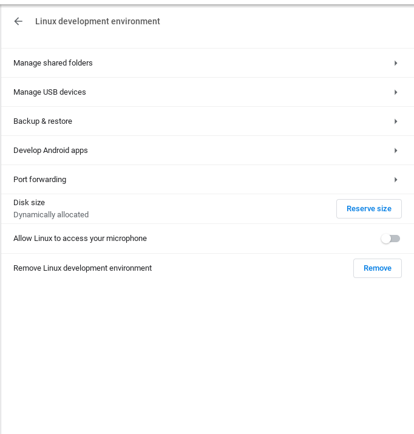

Linux support for ChromeOS has been great.  But the "Beta" monikor has always been a bit concerning.  [Google I/O this year claims that it was going to be out of beta soon.](https://www.androidpolice.com/2021/05/21/linux-on-chrome-os-is-finally-out-of-beta-three-years-later/)  I just now noticed with the update to ChromeOS 92 that the "Beta" ammouncement is gone!

Although [busy passing the CKA](../2021-08-15-cka.md), I had to also make sure I had a bit of time to dig into the beta tag removal.