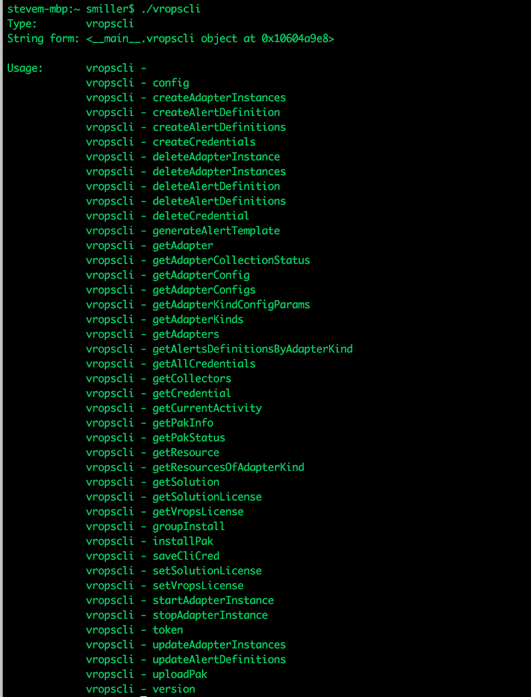
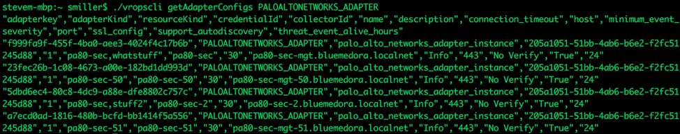

[Original Post](https://bluemedora.com/introducing-vropscli-from-blue-medora/)

by Steven Miller on October 26, 2018

Blue Medora provides [some of the best in breed monitoring integrations](https://bluemedora.com/products/vmware-vrealize-true-visibility/) within VMware vRealize® Operations™ (vROps). Sometimes configuring those integrations, especially for our largest customers, is tedious. In order to help our customers, and the overall vROps ecosystem, we are proud to introduce vROpsCLI, a freely distributed open source project for the vRealize community. This utility can be used alone, or as part of a larger scripted process, to automate many vROps configuration tasks—even tasks unrelated to management pack support. Let’s look at some common use scenarios.

**“Our company just completed a merger, and we now must configure 250 additional SQL servers for monitoring in vROps.”**
vROpsCLI can create all 250 instances for monitoring by Blue Medora from a single text file. Using a manually-created file is one time-saving option, but mining information from an existing CMDB or other internal inventory or configuration management system to generate the file can totally trivialize this task! Instead of manually configuring each server, vROpsCLI will consume the file and configure all your vROps adapter instances automatically.

**“We’ve expanded our vROps environment and the adapters for all 250 SQL Servers are on the same vROps remote collector.”**
Automatically re-distribute adapter instances across a cluster with vROpsCLI. An inventory can be pulled, then based on user criteria, the correct collector or collector group can be assigned. For instance, a short script could be created that would assign an adapter instance to the closest vROps node based on IP address. Far better then trying to do this manually!

**“The security team mandated that all monitoring accounts use unique credentials for each server.”**
Not a problem! With vROpsCLI, you can update credential information for each adapter instance. Better yet, you can impress your security team by scripting a process to rotate those passwords on a regular basis, then use vROPsCLI to update the passwords. Talk about wowing your security and compliance departments!

**“We would like to automate management pack upgrades.”**
Management pack installation and upgrades can be performed with vROpsCLI. This could be easily part of an automated deployment pipeline. Use vROpsCLI to apply the latest management pack updates to a test environment, query that server to verify that collections are still occuring against your test systems, and apply those updates to your production systems. All of these tasks can be configured with minimal interaction.

**“I need to integrate vROps notifications with our event management system.”**
If your corporate standard requires unique alert definitions that meet a certain specified criteria, then vROpsCLI can assist in mass adjustments of the alert definitions within vROps. Alerts can be named so they trigger certain criteria in your enterprise management system.

**“Our DR strategy requires a detailed re-configuration document for vRealize.”**
The full adapter configuration, licensing information, and credential configuration can be stored in text files, in a format that would be trivial to re-import into a brand new installation. The only item that wouldn’t be captured would be sensitive password information, but that could be mitigated by combining with a secure password storage system, perhaps that same system you configured for the security team above.

**Automate everything**
vROpsCLI is now freely available on GitHub. This is the first of a series of posts on how to implement each of the scenarios above. We hope they help you automate more, and make your life easier. And if you’d like to apply vROpsCLI to other use cases, please contact your account representative. You can also [connect with me on GitHub](https://www.github.com/ssmiller25)—I’d love to help!
