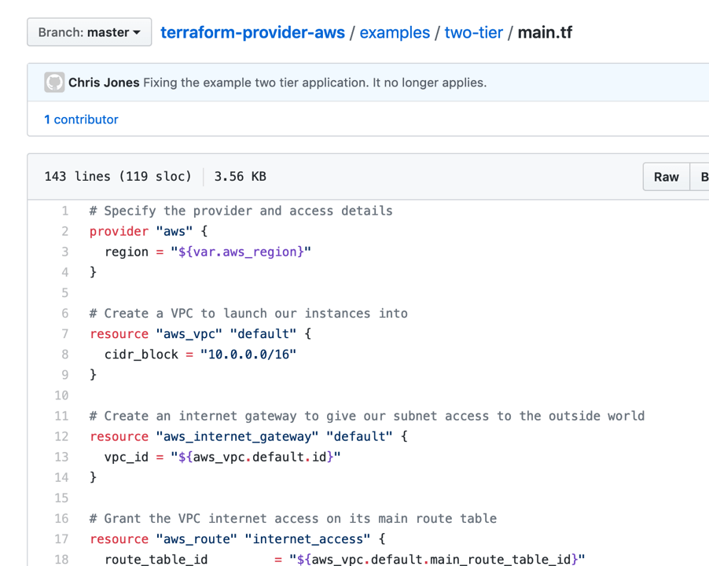

[Original Post](https://bluemedora.com/soc-2-compliance-in-a-code-driven-infrastructure-blue-medora/)

by Steven Miller on May 29, 2019

Blue Medora has recently completed a SOC 2 Type 1 audit by Plante Moran!  Anyone who has been through a SOC 2 audit, or any other compliance regimen (SOX, HIPAA, PCI, etc.) knows that it can be strenuous to ensure you have all your processes and procedures documented, as well as proving out that you follow those procedures.  To my surprise, some of our modern deployment processes made this process easier than expected!  Let’s explore how modern techniques can streamline compliance verification.

**Peer Review Through Version Control**

Version control is a tool that provides a single source of truth to see the history of applications.  That ability, combined with a pull request process that requires peer review, allows for an easily auditable trail for any code changes that are committed.  Any line of code can be traced back to the person who committed the change, and the specific pull request where the change was approved.  When artifacts are required to prove out code changes, it’s as simple as providing the pull request in which the change occurred.

**Continuous Integration/Deployment**

The great thing about this whole process is that the deployment is completely automated, all the way through to production!  Good architecture can result in a system that is more reliable than older methodologies that use longer release cycles ([source](https://pivotal.io/devops/why-devops)).  From a compliance standpoint, it means that no human intervention is required to deploy code to various development or production environments.  All changes to production code are easily audited back to the original “Pull Request” in the version control system.  In addition, security and audit scans can be coded into the continuous integration environment, ensuring these controls are met with every code change.

**Infrastructure as Code**

All infrastructure is defined as code, kept in version control, and deployed via the integrated pipeline.  The same benefits for application code are now available to infrastructure!  All changes are peer reviewed and traceable.  All deployments are logged and occur automatically, with minimal or no direct access required by administrators. 

While this works perfectly for cloud environment, on-premise can be a bit more challenging.  Tooling exists to give similar cloud-like deployment experiences to on-premise virtualization and bare metal environments.  Cloud vendors are even including options to allow for running workloads on-premise using the same APIs and tooling used to deploy cloud workloads.

**Efficient Rollback**

With a rapid deployment cycle, the ability to rollback quickly is essential.  Rollbacks are handled via the standard deployment pipeline.  Rollbacks are fully documented within version control system and the deployment pipeline process.  Documentation is easily achieved by adding notes to the pull requests responsible for putting the infrastructure back to a previous state.  Post-mortems can be tied back to the original rollback for documentation and audit purposes.

**Conclusions and Next Steps**

Keeping both the application and infrastructure fully defined in code, allows for a lot of efficiencies not only in operational effectiveness, but also in compliance and security processes.  Once those are defined in code, the next move would be to bring policy and procedure documentation into code as well!  This is sometimes referred to as “compliance as code” (defined by [O’Reilly](https://www.oreilly.com/learning/compliance-as-code)) and closer to “everything as code”.  

Many resources exist to help in your journey.  [Pivotal’s Overview of DevOps practices is a great example](https://pivotal.io/devops/why-devops). For more specific compliance resources, review the [“DevOps Audit Defense Toolkit”](https://dl.orangedox.com/audit-defense). You can also save a lot of time and work by checking out this [compliance Automation framework](https://github.com/strongdm/comply), [this security documentation builder](https://github.com/opencontrol/compliance-masonry), and this [repo for OpenControl-formatted industry standards and required documentation](https://github.com/opencontrol/standards). The best thing is that this is all open source!

Can you imagine a continuous integration pipeline that tests if policies are being followed?  How about an automated procedure to generate the artifacts for auditors?

It is certainly a brave new world, but one in which compliance can be viewed as part of the overall pipeline, and not simply something that is “done.”
